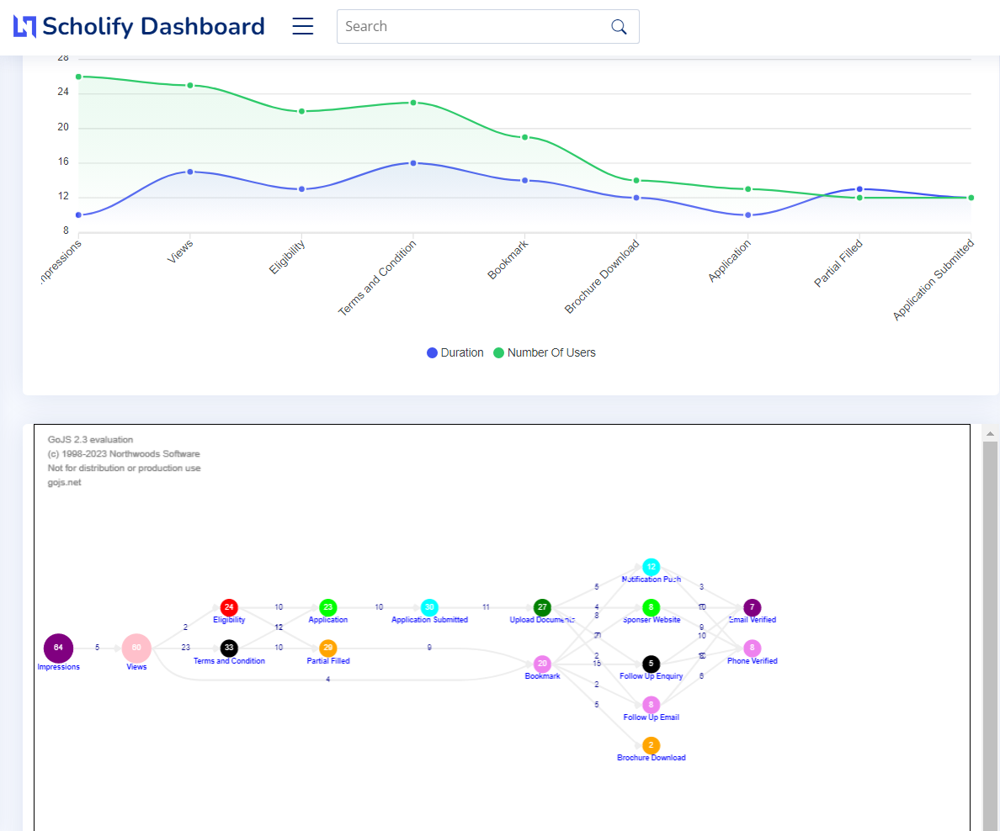

## Hack The Tank

first npm install then 
node bin/www to run server
go to localhost:3001 and check dashboard.

track.html has code to track user data and show demo analysis

## Screenshots

[alt text](screenshots/s2.png)

